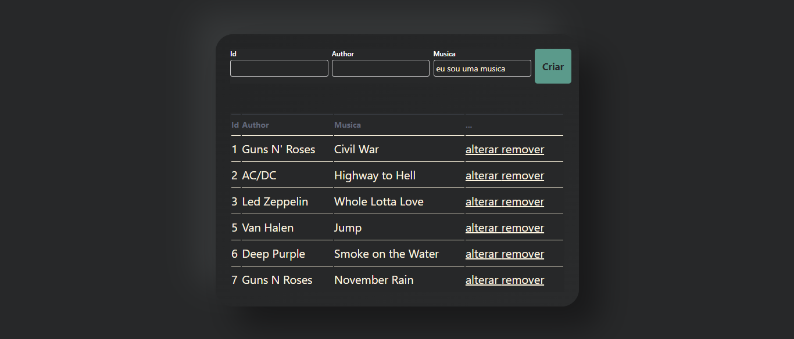
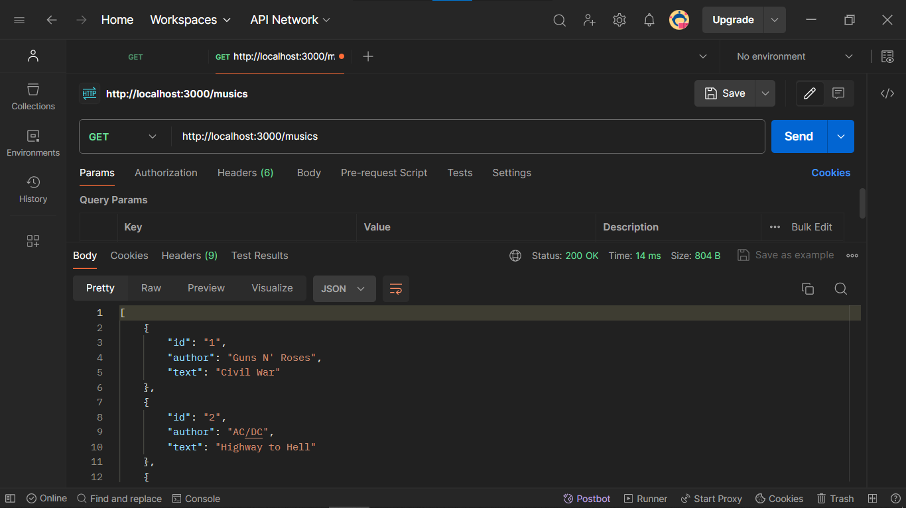
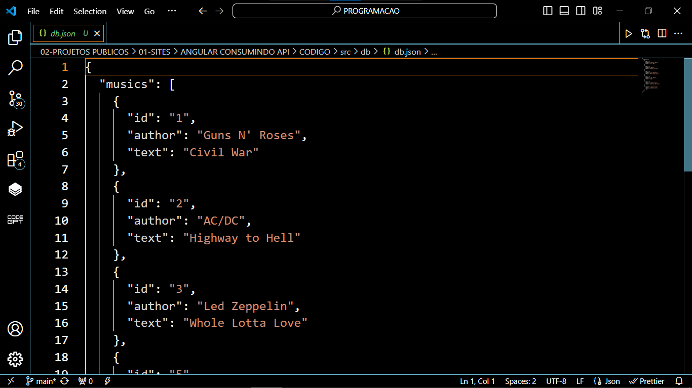
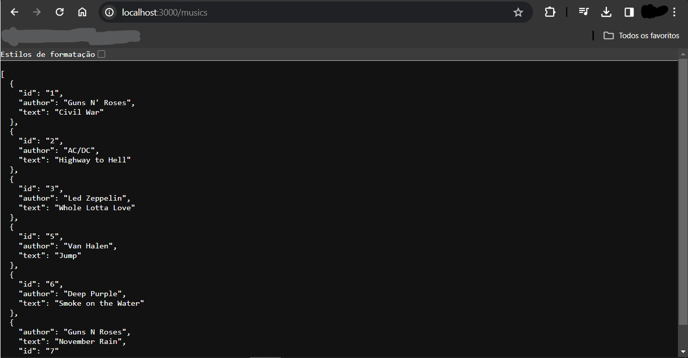

# LISTA DE MUSICAS COM ANGULAR
👨‍🏫APP DE FORMULARIO DE MÚSICAS FAVORITAS FEITO COM ANGULAR E JSON-SERVER.

 <br> 
 <br> 
 <br> 
 <br> 

## DESCRIÇÃO:
Este app é uma aplicação de gerenciamento de músicas, onde os usuários podem adicionar, visualizar, editar e excluir músicas da lista (CRUD). Aqui está uma descrição das principais funcionalidades:

1. **Formulário de Entrada de Dados:**
   - O formulário permite aos usuários adicionar novas músicas à lista. Ele possui campos para o ID (geralmente preenchido automaticamente), autor e título da música. O campo de ID é desativado, o que significa que não pode ser editado manualmente pelo usuário.

2. **Botão "Criar" ou "Salvar":**
   - Dependendo do estado do formulário (se um ID já estiver definido ou não), o botão exibirá "Criar" ou "Salvar". Se o ID estiver preenchido, significa que o usuário está editando uma música existente e o botão será "Salvar". Caso contrário, será "Criar" para adicionar uma nova música.

3. **Lista de Músicas:**
   - Abaixo do formulário, há uma tabela que exibe todas as músicas existentes na lista. Cada música é exibida em uma linha separada da tabela.
   - As colunas exibem o ID, autor e título da música.
   - Para cada música, há opções para editar ou excluir. Clicar em "alterar" permite que o usuário preencha novamente o formulário com os detalhes dessa música para edição. Clicar em "remover" exclui permanentemente a música da lista.

4. **Atualizações em Tempo Real:**
   - A lista de músicas é atualizada em tempo real à medida que novas músicas são adicionadas ou existentes são editadas ou removidas. Isso é possível através do uso de observáveis e a função `async` na diretiva `*ngFor`, que permite a visualização dinâmica dos dados.

## EXECUTANDO O PROJETO:
1. **Instalando as Depêndencias:**
   - Para instalar as dependências listadas no arquivo "package.json", você pode usar o comando `npm install` ou simplesmente `npm i` no terminal. Certifique-se de estar no diretório do seu projeto onde o arquivo "package.json" está localizado (No diretório `moments` e `API`). O npm irá ler o arquivo "package.json" e instalar todas as dependências listadas nele. 

   - Aqui está o comando:

   ```bash
   npm install
   ```

   ou

   ```bash
   npm i
   ```

2. **Iniciando o Servidor Localmente:**
   Antes de fazer solicitações para a URL da API, é necessário iniciar o servidor localmente. Você pode iniciar o servidor executando o comando no diretório `CODIGO`:
   ```
   json-server --watch ./src/db/db.json
   ```

3. **Testando API:**
   - Para testar a API, você pode utilizar uma ferramenta de cliente HTTP, como o **Postman**, **Insomnia**, **Paw** ou **SoapUI**. Você pode acessar a API usando o seguinte link:
   ```
    http://localhost:3000/musics
   ```
   
4. **Executando o Aplicativo:**
   - Para subir o servidor, no diretório `CODIGO`, abra outro Terminal/CMD e digite o seguinte comando:
   ```bash
   ng serve
   ```
   - Acesse o APP no navegador visitando `http://localhost:4200`.

5. **Usando o APP:**
   - **Adicionar uma Nova Música:**
      - No formulário de entrada de dados, preencha os campos "Author" e "Musica" com as informações da nova música que deseja adicionar.
      - Clique no botão "Criar" para adicionar a música à lista.

   -**Editar uma Música Existente:**
      - Na lista de músicas exibida abaixo do formulário, clique na opção "alterar" ao lado da música que deseja editar.
      - Isso preencherá automaticamente os campos do formulário com os detalhes da música selecionada.
      - Faça as alterações desejadas nos campos do formulário.
      - Clique no botão "Salvar" para aplicar as alterações à música.

   - **Excluir uma Música Existente:**
      - Na lista de músicas, clique na opção "remover" ao lado da música que deseja excluir.
      - Isso removerá permanentemente a música da lista.

   - **Visualizar Músicas Existente:**
      - Na lista de músicas, você pode visualizar todas as músicas existentes, incluindo seus IDs, autores e títulos.

   - **Atualizações em Tempo Real:**
      - As alterações feitas na lista de músicas serão refletidas instantaneamente na interface, sem a necessidade de atualizar a página. Isso permite uma experiência de usuário mais fluida e dinâmica.

## NÃO SABE?
- Entendemos que para manipular arquivos em `HTML`, `CSS` e outras linguagens relacionadas, é necessário possuir conhecimento nessas áreas. Para auxiliar nesse aprendizado, oferecemos cursos gratuitos disponíveis:
* [CURSO DE HTML E CSS](https://github.com/VILHALVA/CURSO-DE-HTML-E-CSS)
* [CURSO DE NODEJS](https://github.com/VILHALVA/CURSO-DE-NODEJS)
* [CURSO DE ANGULAR](https://github.com/VILHALVA/CURSO-DE-ANGULAR)
* [CURSO DE JSON SERVER](https://github.com/VILHALVA/CURSO-DE-JSON-SERVER)
* [CONFIRA MAIS CURSOS](https://github.com/VILHALVA?tab=repositories&q=+topic:CURSO)

## CREDITOS:
- [PROJETO CRIADO PELO "cristianWilliam"](https://github.com/cristianWilliam/ANGULAR-CONSUMINDO-API)
- [VEJA O VIDEO SOBRE O PROJETO](https://youtu.be/rjrQpMYtTUw?si=Hb9r3SQk6-EwYXPI)
- [PROJETO FEITO PELO VILHALVA](https://github.com/VILHALVA)


